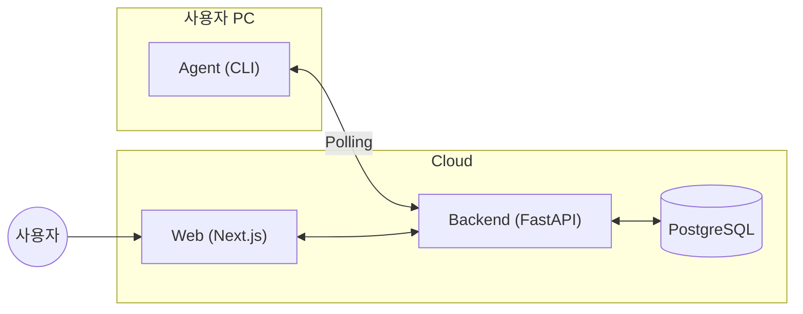
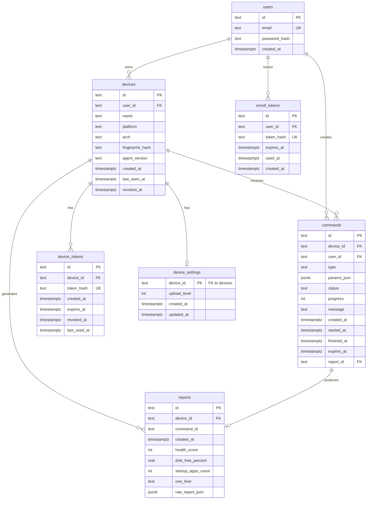
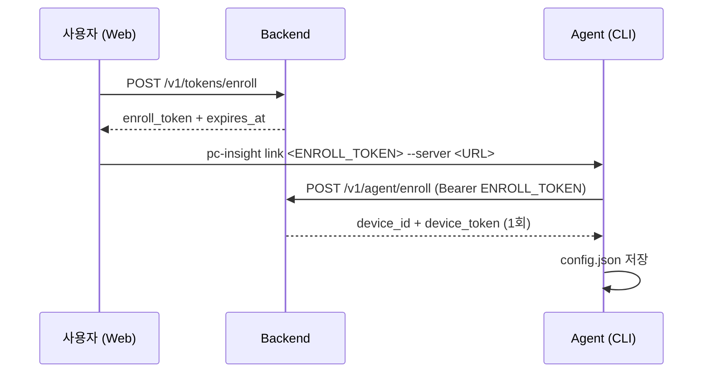
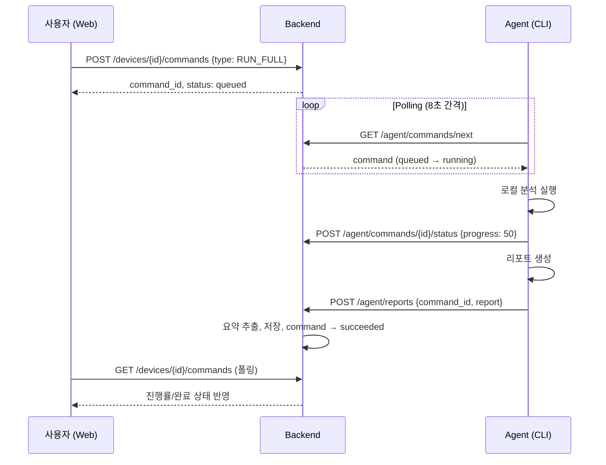
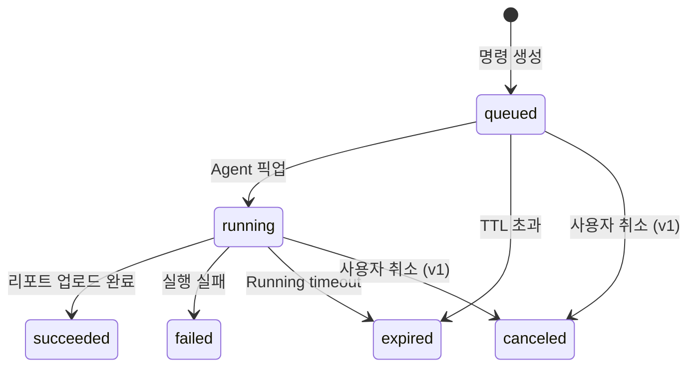

# pc-insight Cloud 개발 분석 문서

> 이 문서는 `docs/` 디렉토리의 모든 문서를 기반으로 개발 착수가 가능하도록 작성된 상세 분석입니다.

---

## 1. 프로젝트 개요

**pc-insight Cloud**는 **멀티 디바이스 PC 건강검진 및 원격 운영 대시보드** 시스템입니다.

### 1.1 핵심 가치
- 사용자는 여러 대의 PC를 **웹 대시보드에서 통합 관리**
- 원격 명령으로 **즉시 점검 실행** 가능
- **프라이버시 중심** 설계 (파일 내용 수집 안 함, 경로는 기본 숨김)
- 자동 삭제 없음, **사용자 통제권 유지**

### 1.2 시스템 구성



| 컴포넌트 | 기술 스택 | 역할 |
|---------|----------|------|
| **Agent** | Node.js, TypeScript | 로컬 분석, 명령 폴링, 리포트 업로드 |
| **Backend** | FastAPI, Python, asyncpg | 인증, 디바이스 관리, 커맨드 큐, 리포트 저장 |
| **Web** | Next.js (App Router) | 대시보드, 원격 명령 UI, 리포트 뷰어 |
| **Database** | PostgreSQL 14+ | 영속화 계층 |

---

## 2. 기능 요구사항 (MVP → v1)

### 2.1 MVP 필수 기능

| 영역 | 기능 | 설명 |
|-----|------|------|
| **인증** | 웹 로그인 | Email+Password 또는 OAuth 1종 |
| **디바이스** | 등록 | Enrollment Token → link → Device Token 발급 |
| **디바이스** | 목록/상세 | 웹에서 디바이스 상태 조회 |
| **커맨드** | 원격 명령 생성 | RUN_FULL, RUN_DEEP, PING 등 (Allowlist) |
| **커맨드** | 폴링 기반 수신 | Agent가 `/agent/commands/next` 폴링 |
| **커맨드** | 상태 관리 | queued → running → succeeded/failed/expired |
| **리포트** | 업로드 | 로컬 분석 결과를 서버로 전송 |
| **리포트** | 조회 | 웹에서 요약 및 Raw JSON 확인 |
| **안정성** | Outbox 재시도 | 업로드 실패 시 로컬 저장 후 재시도 |
| **안정성** | Processed Store | 명령 중복 실행 방지 |

### 2.2 v1 권장 기능

| 기능 | 설명 |
|------|------|
| Agent 자동 실행 | macOS launchd, Windows Task Scheduler, Linux systemd |
| Device Revoke | 디바이스 연결 해제 UI/API |
| Device Settings | 업로드 레벨(0/1/2) 정책 설정 |
| 서버-side Sanitize | 서버에서 정책 강제 적용 |
| Heartbeat API | 마지막 접속 시간 갱신 강화 |
| 커맨드 재시도/취소 | 웹에서 retry/cancel 버튼 |

---

## 3. 데이터베이스 스키마

### 3.1 테이블 구조



### 3.2 핵심 인덱스

| 테이블 | 인덱스 | 용도 |
|--------|--------|------|
| `commands` | `(device_id, status, created_at asc)` | Agent 폴링 최적화 |
| `reports` | `(device_id, created_at desc)` | 최신 리포트 조회 |
| `device_tokens` | `(token_hash unique)` | 토큰 검증 |
| `devices` | `(user_id, last_seen_at desc)` | 대시보드 목록 |

---

## 4. API 명세

### 4.1 인증 체계

| API 종류 | 인증 방식 | 헤더 |
|---------|----------|------|
| **Web API** | JWT/세션 | `Authorization: Bearer <USER_JWT>` |
| **Agent API** | Device Token | `Authorization: Bearer <DEVICE_TOKEN>` |
| **Enrollment** | Enroll Token | `Authorization: Bearer <ENROLL_TOKEN>` |

### 4.2 Web API (사용자 인증 필요)

| Method | Path | 설명 |
|--------|------|------|
| `POST` | `/v1/tokens/enroll` | Enrollment Token 발급 |
| `GET` | `/v1/devices` | 디바이스 목록 |
| `GET` | `/v1/devices/{device_id}` | 디바이스 상세 |
| `POST` | `/v1/devices/{device_id}/commands` | 원격 명령 생성 |
| `GET` | `/v1/devices/{device_id}/commands` | 명령 히스토리 |
| `GET` | `/v1/reports/{report_id}` | 리포트 상세 |
| `POST` | `/v1/devices/{device_id}/revoke` | 디바이스 연결 해제 |
| `PUT` | `/v1/devices/{device_id}/settings` | (v1) 정책 설정 |

### 4.3 Agent API (DEVICE_TOKEN 필요)

| Method | Path | 설명 |
|--------|------|------|
| `POST` | `/v1/agent/enroll` | 디바이스 등록 (ENROLL_TOKEN 사용) |
| `GET` | `/v1/agent/commands/next` | 다음 명령 폴링 |
| `POST` | `/v1/agent/commands/{id}/status` | 상태 업데이트 |
| `POST` | `/v1/agent/reports` | 리포트 업로드 |
| `POST` | `/v1/agent/heartbeat` | (v1) Heartbeat |

### 4.4 커맨드 타입 (Allowlist)

| 타입 | 설명 |
|-----|------|
| `RUN_FULL` | 전체 점검 (스토리지/프라이버시/슬로우다운) |
| `RUN_DEEP` | 심층 점검 (중복 파일 추정 포함) |
| `RUN_STORAGE_ONLY` | 스토리지 중심 점검 |
| `RUN_PRIVACY_ONLY` | 프라이버시 중심 점검 |
| `RUN_DOWNLOADS_TOP` | Downloads 큰 파일 후보 |
| `PING` | 최소 헬스체크 |

---

## 5. 데이터 흐름

### 5.1 디바이스 등록 플로우



### 5.2 원격 명령 실행 플로우



### 5.3 커맨드 상태 전이



---

## 6. Agent 설계

### 6.1 CLI 명령어

| 명령어 | 설명 |
|--------|------|
| `pc-insight link <TOKEN> --server <URL>` | 디바이스 등록 |
| `pc-insight agent [--interval ms]` | 폴링 모드 실행 (기본 8000ms) |
| `pc-insight run <profile>` | 로컬 수동 실행 |
| `pc-insight install-agent` | (v1) 자동 실행 설치 |
| `pc-insight uninstall-agent` | (v1) 자동 실행 제거 |
| `pc-insight outbox` | (선택) 재시도 큐 상태 확인 |

### 6.2 로컬 데이터 저장

| 파일 | 용도 |
|------|------|
| `~/.pc-insight/config.json` | serverUrl, deviceId, deviceToken |
| `~/.pc-insight/outbox/*.json` | 업로드 재시도 큐 |
| `~/.pc-insight/processed.json` | 중복 실행 방지 |

### 6.3 리포트 생성 파이프라인

1. **Folder Summary**: Downloads/Desktop/Documents 등 용량/파일 수
2. **Disk Free**: 디스크 여유율
3. **Startup Items**: 시작 프로그램 수
4. **Privacy Snapshot**: 브라우저 캐시 용량 합
5. **Duplicates** (Deep 모드): 해시 기반 중복 그룹화
6. **Health Score**: 규칙 기반 점수 산출
7. **Recommendations**: 정리 추천 목록

---

## 7. 보안 및 프라이버시

### 7.1 토큰 정책

| 토큰 | 수명 | 저장 방식 | 특징 |
|-----|------|----------|------|
| **Enrollment Token** | 단기 (기본 60분) | DB: hash | 1회성, 등록 후 사용 불가 |
| **Device Token** | 장기 (기본 1년) | DB: hash | 회수 가능(revoke) |

### 7.2 업로드 레벨 정책

| Level | 설명 |
|-------|------|
| **0** (기본) | 요약만 저장, 경로/파일명 숨김 |
| **1** | 파일명만 저장 (경로 제거) |
| **2** | 전체 경로 저장 |

> [!IMPORTANT]
> 서버가 정책을 강제합니다. Agent가 Level 2로 보내도 서버 설정이 Level 0이면 마스킹 적용.

### 7.3 보안 원칙

- **Allowlist 기반 명령**: 임의 shell 실행 금지
- **토큰 로그 금지**: 로그에 토큰/민감정보 미출력
- **Rate Limiting**: (v1) 토큰 발급/API 호출 횟수 제한
- **Payload 크기 제한**: DoS 방어 (최대 2~5MB)

---

## 8. 배포 환경

### 8.1 Backend 환경변수

| 변수 | 설명 |
|------|------|
| `DATABASE_URL` | PostgreSQL 연결 문자열 |
| `JWT_SECRET` | (v1) JWT 서명 키 |
| `CORS_ORIGINS` | 허용 origin |
| `LOG_LEVEL` | 로그 레벨 |
| `SENTRY_DSN` | (선택) 에러 리포팅 |

### 8.2 Web 환경변수

| 변수 | 설명 |
|------|------|
| `NEXT_PUBLIC_API_BASE` | Backend API URL |

### 8.3 권장 아키텍처

```
┌─────────────┐     ┌─────────────┐     ┌─────────────┐
│   CDN/Web   │────▶│  Next.js    │────▶│  FastAPI    │
│   (Static)  │     │  (SSR/CSR)  │     │  (API)      │
└─────────────┘     └─────────────┘     └─────────────┘
                                               │
                                               ▼
                                        ┌─────────────┐
                                        │  PostgreSQL │
                                        │  (Managed)  │
                                        └─────────────┘
```

---

## 9. 개발 워크플로우

### 9.1 로컬 개발 순서

1. **DB 준비**: PostgreSQL 실행, `DATABASE_URL` 설정
2. **Backend 실행**: `uvicorn app.main:app --reload --port 8000`
3. **Web 실행**: `NEXT_PUBLIC_API_BASE=http://localhost:8000 npm run dev`
4. **연결 테스트**:
   - 웹에서 토큰 발급
   - `pc-insight link <TOKEN> --server http://localhost:8000`
   - `pc-insight agent`
5. **명령 실행**: 웹에서 RUN_FULL 클릭 → 진행률 확인 → 리포트 생성 확인

### 9.2 권장 프로젝트 구조

```
/
├── agent/              # Agent (Node.js/TypeScript)
│   ├── src/
│   ├── package.json
│   └── README.md
├── server/             # Backend (FastAPI/Python)
│   ├── app/
│   ├── migrations/
│   ├── pyproject.toml
│   └── README.md
├── web/                # Web (Next.js)
│   ├── app/
│   ├── components/
│   ├── package.json
│   └── README.md
├── docs/               # 문서
├── ops/                # 운영 스크립트 (launchd, systemd 등)
└── README.md
```

---

## 10. 구현 우선순위

### Phase 0 (기반)
- [ ] Command queue + polling 구조
- [ ] Report upload + 기본 저장
- [ ] Devices UI (목록/상세)

### Phase 1 (운영 필수)
- [ ] Web Auth (JWT/세션) 도입
- [ ] Device revoke UI + API
- [ ] Device settings (upload_level)
- [ ] 서버-side sanitize
- [ ] Agent 자동 실행 설치 (3 OS)
- [ ] 로그 마스킹 정비

### Phase 2 (제품 품질)
- [ ] 리포트 UI 정리 (표/카드)
- [ ] 체크리스트 UI
- [ ] Retry/Cancel 버튼
- [ ] Running timeout 처리
- [ ] Heartbeat API

### Phase 3 (확장)
- [ ] SSE/WebSocket 실시간 진행률
- [ ] 리포트 히스토리 차트
- [ ] 조직/권한 모델

---

## 11. 오픈 이슈

| 이슈 | 옵션 |
|------|------|
| 로그인 방식 | Email+Password vs OAuth (GitHub/Google) |
| Raw Report 저장 | 기본 저장 vs 옵트인 |
| Deep 분석 제한 | maxFiles, minBytes 튜닝 |
| 무료 플랜 제한 | 디바이스 수/리포트 보존 정책 |

---

## 12. 참고 문서

| 문서 | 내용 |
|------|------|
| [PRD.md](file:///Users/hwanchoi/projects/remote_pc_insight/docs/PRD.md) | 제품 요구사항 |
| [TRD.md](file:///Users/hwanchoi/projects/remote_pc_insight/docs/TRD.md) | 기술 요구사항 |
| [FUNCTIONAL_SPEC.md](file:///Users/hwanchoi/projects/remote_pc_insight/docs/FUNCTIONAL_SPEC.md) | 기능 명세 |
| [API_SPEC.md](file:///Users/hwanchoi/projects/remote_pc_insight/docs/API_SPEC.md) | API 상세 명세 |
| [DB_SCHEMA.md](file:///Users/hwanchoi/projects/remote_pc_insight/docs/DB_SCHEMA.md) | 데이터베이스 스키마 |
| [ARCHITECTURE.md](file:///Users/hwanchoi/projects/remote_pc_insight/docs/ARCHITECTURE.md) | 시스템 아키텍처 |
| [SECURITY.md](file:///Users/hwanchoi/projects/remote_pc_insight/docs/SECURITY.md) | 보안 고려사항 |
| [PRIVACY.md](file:///Users/hwanchoi/projects/remote_pc_insight/docs/PRIVACY.md) | 프라이버시 정책 |
| [INSTALL_AGENT.md](file:///Users/hwanchoi/projects/remote_pc_insight/docs/INSTALL_AGENT.md) | Agent 자동 실행 설치 |
| [DEPLOYMENT.md](file:///Users/hwanchoi/projects/remote_pc_insight/docs/DEPLOYMENT.md) | 배포 가이드 |
| [RUNBOOK.md](file:///Users/hwanchoi/projects/remote_pc_insight/docs/RUNBOOK.md) | 운영 런북 |
| [TROUBLESHOOTING.md](file:///Users/hwanchoi/projects/remote_pc_insight/docs/TROUBLESHOOTING.md) | 문제 해결 |
